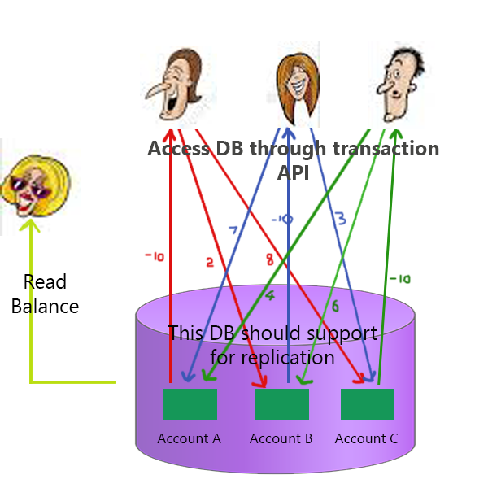

# MongoDB-Transactions-API-Self-Learning

This small set of program demonstrate how to implement MongoDB transaction API with python.

## Description



This is simple bank application that demonstrate the behavior of transaction API's when multiple programs trying to access same database element parallel.

There are 3 person (A, B and C). Each person is trying to take some money from their account and transfer to others bank accounts.

same time another person check the balance of each person and the total amount continuously. 

At the start, each person have 1000 balance. So total balance of 3 person is 3000. If the DB transactions happen correctly, Individual balance can be changed but total amount should not change.

## setup

1. Install MongoDB
https://docs.mongodb.com/manual/tutorial/install-mongodb-on-ubuntu/

2. Install Robot 3T(Optional).
https://robomongo.org/download

3. Create DB called ```Bank```. Then inside of Bank DB, create a collection called ```Account```.

### convert data base from standalone-to-replication.

4. Since this program is developed using transaction API, it is required to convert the used data base from standalone-to-replica-set. To do that, please follow below instructions.

    4.1 Shut down the standalone mongod instance. ```service mongod stop```

    4.2 Restart the instance. Use the --replSet option to specify the name of the new replica set.

    ```sudo mongod --port 27017 --dbpath /var/lib/mongodb --replSet rs0 --bind_ip localhost --setParameter "transactionLifetimeLimitSeconds=60"```  

    4.3 Open another terminal and connect the mongo shell to the mongod instance. ```service mongod start``` then ```mongo```

    4.4 Use rs.initiate() to initiate the new replica set ```rs.initiate()```. Next run ```rs.status()``` again to check whether replication is correctly initialized or not.

5. then you can start run application.

    5.1 first run check_person.py by following command ```python3 check_person.py```

    5.2 Then other programs.

    ```python3  person_A.py```

    ```python3  person_B.py```

    ```python3  person_C.py```

## Sources

https://docs.mongodb.com/manual/core/transactions/
https://docs.mongodb.com/manual/tutorial/convert-standalone-to-replica-set/
https://docs.mongodb.com/manual/core/transactions-in-applications/


